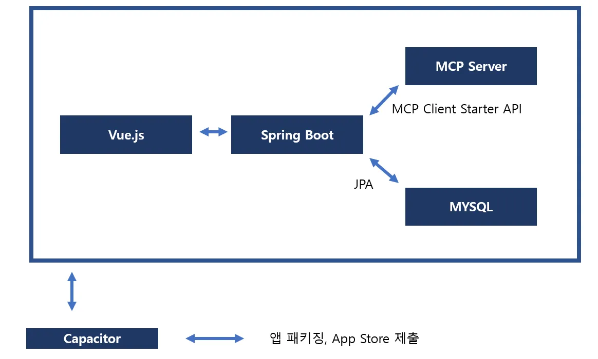

# 📈 StockSummaryApp

---

## 프로젝트 개요 

| 항목 | 내용 |
| --- | --- |
| 🎯 목적 | 주식 상승/하락 이유를 자동으로 요약하고, 알림 조건을 유저가 세세하게 설정할 수 있는 앱 개발 |
| 🔧 핵심 기능 | - 실시간 주가 기반 알림 - AI 뉴스 요약 - 최근 주식 동향 뉴스 분석 |
| 📱 출시 대상 | Android 우선 (iOS 추후 가능) |
| 🧠 AI 역할 | 뉴스 요약, 주가 변동 이유 추정 (LLM 활용) |

## 기술스택
- SpringBoot
- Vue.js
- Capacitor
- 주식 시세 Open Api
- DB (Mysql)

## 시스템 구조

